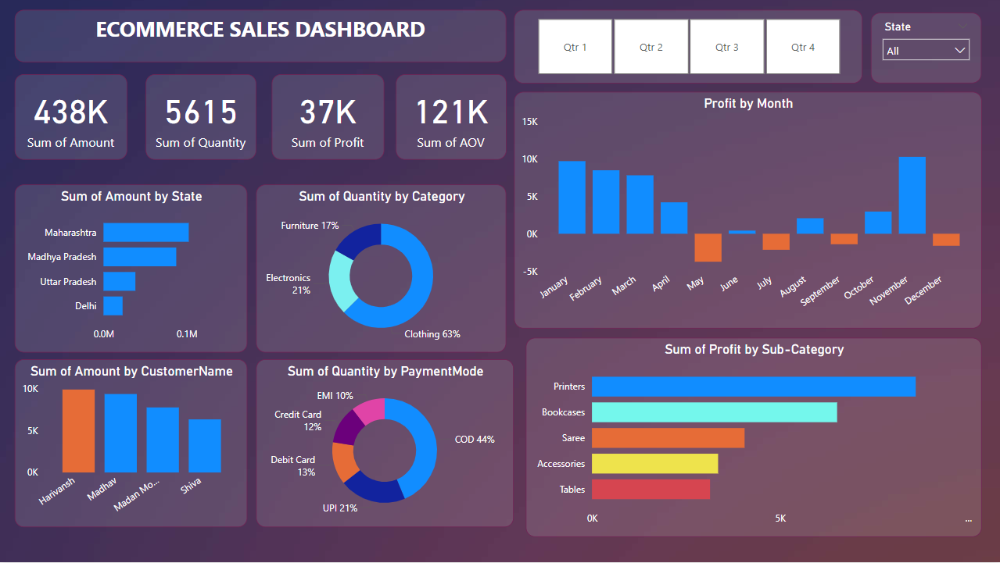

# Ecommerce_Store_PowerBI
Power BI Dashboard for Ecommerce Store Data Analysis

## Overview
This project involves creating a Power BI dashboard to analyze data for an ecommerce store. The dashboard provides key performance indicators (KPIs) and insights into sales, profits, and customer behavior. 

---
## Dashboard Preview

---

## Key Performance Indicators (KPIs)
- **Sum of Amount**: **438K**  
  Total revenue or sales generated.
  
- **Sum of Quantity**: **5615**  
  Total units of products sold.
  
- **Sum of Profit**: **37K**  
  Total profit earned.
  
- **Sum of AOV (Average Order Value)**: **121K**  
  The average value of each order.

---

## Insights from Visualizations

### Donut Graphs
1. **Sum of Quantity by Category**:
   - **Clothing**: 63%  
   - **Electronics**: 21%  
   - **Furniture**: 17%  
   **Insight**: Clothing dominates the quantity of products sold, followed by Electronics and Furniture.

2. **Sum of Quantity by Payment Mode**:
   - **Cash on Delivery (COD)**: 44%  
   - **UPI**: 21%  
   - **Debit Card**: 13%  
   - **Credit Card**: 12%  
   - **EMI**: 10%  
   **Insight**: COD is the most preferred payment method, while EMI is the least used.

---

### Bar Graphs
1. **Profit by Month**:
   - Highest profit was recorded in **November**.
   - Losses observed in **May**.
   - Significant profits in **January, February, and November**.
   **Insight**: Profit trends are seasonal.

2. **Sum of Amount by State**:
   - **Maharashtra** leads in total sales revenue.
   - Followed by **Madhya Pradesh**, **Uttar Pradesh**, and **Delhi**.
   **Insight**: These states are major contributors to overall revenue.

3. **Sum of Profit by Sub-Category**:
   - **Printers** generate the highest profit.
   - High-profit sub-categories include **Bookcases** and **Accessories**.
   - **Sarees** and **Tables** contribute comparatively lower profits.
   **Insight**: Investments in high-profit sub-categories can maximize profitability.

4. **Sum of Amount by Customer Name**:
   - Top customers include **Harsh**, **Madhav**, and **Madan Mohan**.
   - **Shiva** contributes less compared to the top customers.
   **Insight**: Identifying and targeting high-value customers can boost revenue.

---

## Conclusion
This Power BI dashboard provides actionable insights into sales performance, customer behavior, and profit trends, enabling data-driven decision-making for the ecommerce store.

